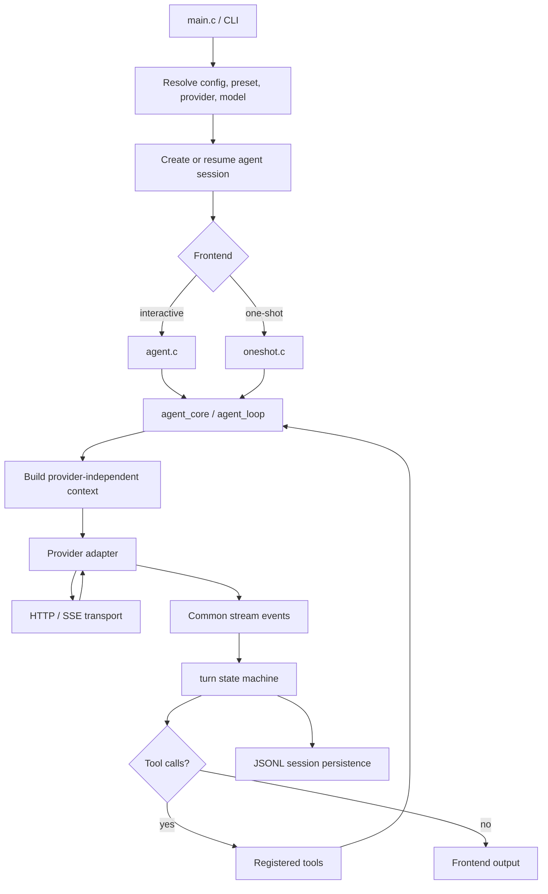

# Runtime flow

## Invocation modes

The executable supports two primary front ends:

- **Interactive REPL** — `hax` starts a terminal-native conversation.
- **One-shot** — `hax -p "…"`, piped prompts, and resumed one-shot invocations perform a bounded interaction and return output to the caller.

Both use the same provider-independent agent machinery. Front-end-specific code handles presentation, input, cancellation, and output shape rather than reimplementing the model/tool loop.

## Startup

`src/main.c` initializes configuration and CLI state, resolves the requested provider/model/effort or preset, restores a session when requested, and chooses the interactive or one-shot front end.

Configuration comes from multiple layers. Durable user intent is held in XDG config, interactive choices in XDG state, environment variables provide shell/process overrides, and explicit CLI choices apply to the current invocation. A resumed conversation can restore its own provider/model/effort selection unless an explicit process-level choice overrides it.

The selected provider is constructed through the provider registry/configuration layer. Model metadata is resolved separately so the core can reason about capabilities such as context size, images, tools, effort values, and estimated cost without embedding those decisions inside each agent path.

## Building a model request

The agent keeps the canonical conversation as provider-independent items. Before a request, the core derives the model-visible context:

- system prompt and environment/context material;
- the active conversation window;
- tool declarations;
- model effort;
- image-input capability;
- stable session identity when available.

When older history is compacted, the original records remain in the canonical log. The model-visible context starts at the latest compaction seed instead of resending the whole earlier history.

## Provider streaming and turn assembly

The selected provider serializes the common context into its native API format. Shared transport code owns HTTP, SSE, retries, certificate handling, and related mechanics.

Provider-specific response parsing emits common stream events. `src/turn.c` consumes these events and builds owned conversation items. The state machine does not own terminal presentation or network I/O.

## Tool continuation

If a completed model turn contains tool calls, the shared agent loop dispatches them through the registered tool definitions. Tool results are appended to the common conversation state and another provider turn is made.

This continues until the model produces a terminal response, the configured turn limit is reached, or execution is cancelled or fails.

The same continuation semantics serve the interactive and one-shot front ends.

## Persistence and display

When session recording is enabled, conversation changes are written to JSONL in an XDG state path associated with the current working directory. Resume rehydrates provider-independent items and selection metadata rather than replaying a provider-native transcript.

Presentation has separate projections:

- `history` reconstructs the user-facing conversation;
- `transcript` exposes what the model saw;
- `render` and `terminal` modules handle terminal output and interaction.

## Development and test runtime

The normal build path is `make`. `make tests` builds and runs unit plus end-to-end tests. The mock provider gives deterministic agent behavior without paid or external LLM calls.

Interactive scenarios use tmux to supply a real terminal. Lower-level provider, transport, state-machine, tool, and persistence behavior is tested without requiring a TTY.

## Runtime flow diagram

