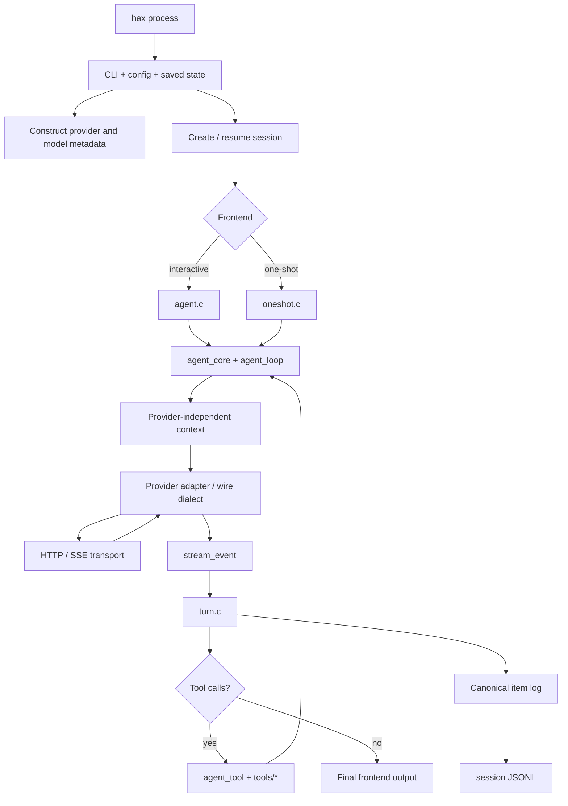
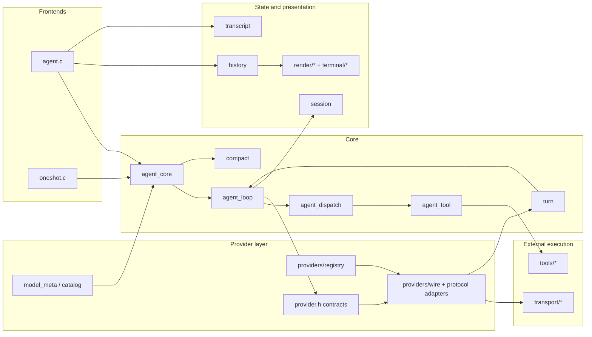
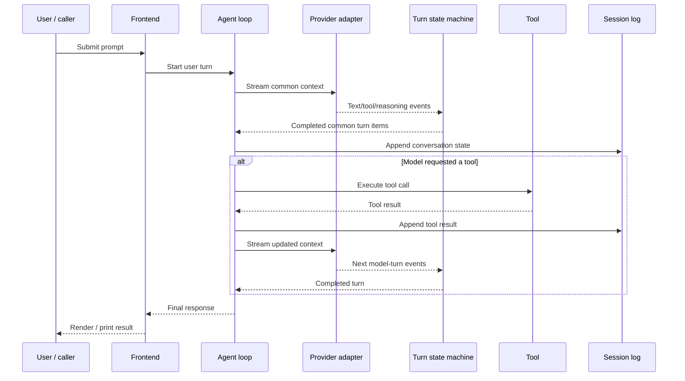
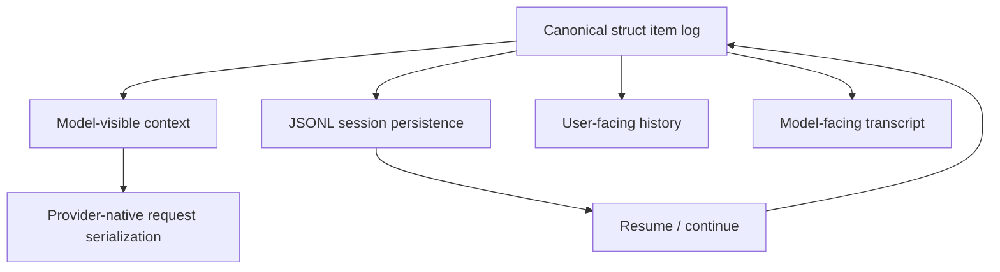

# Architecture diagrams

## 1. Runtime flow

## 2. Module interaction map

## 3. Model turn and tool-call sequence

## 4. Conversation representations

The important distinction is that provider payloads, terminal display, and persisted session data are projections around the common item model rather than competing sources of truth.
